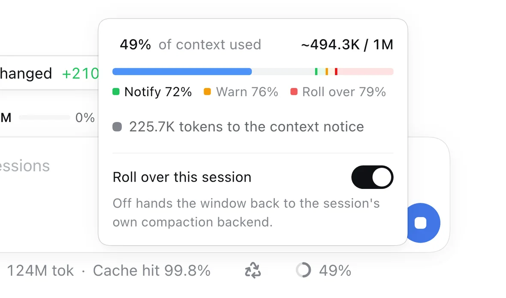
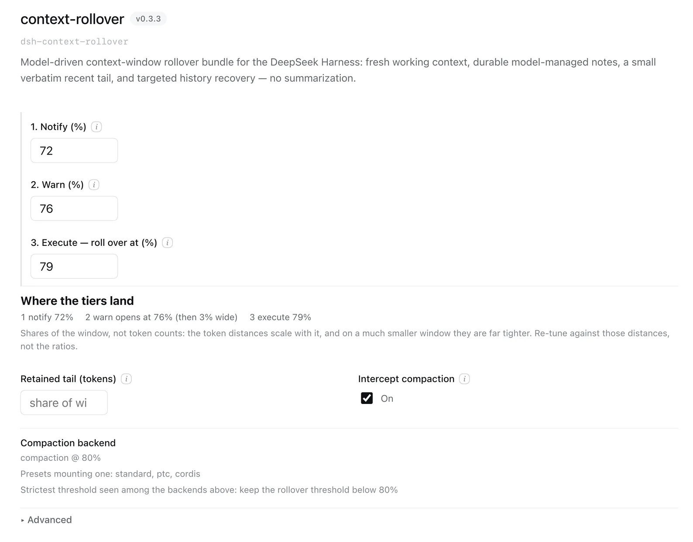

# dsh-context-rollover

[English](README.md) | [中文](README.zh.md)

A [DeepSeek Harness](https://github.com/deepseek-ai/deepseek-harness) bundle for
**model-driven context self-management**: the model ends a context window on purpose and
continues in a fresh one, with **no summarization**. Its own notes and the last few
messages carry over; everything else stays in the session log, searchable on demand.
Inspired by the context-management model in `openai/codex`.

This repository is a rewrite and continuation of the original
[dsh-context-rollover](https://github.com/athif23/dsh-context-rollover), started by
athif23.

## What you get

Stock compaction waits for the window to fill up, then has an LLM summarize what it is
about to drop. This plugin replaces that with notes the working model wrote itself:

| | Summarization (`dsh-compaction-basic`) | Rollover (this plugin) |
|---|---|---|
| What survives | an LLM's summary of the dropped conversation | the model's notes, its handoff, and the last messages verbatim |
| When it happens | when the counter trips — possibly mid-task | at a phase boundary the model picks |
| The dropped conversation | summarized away | kept, and searchable with the `history` tool |
| Cost | one extra LLM call per compaction | zero; the same notes always give the same checkpoint |

In one line: **the model that did the work writes the handover, instead of a stranger
guessing what mattered.**

It installs into any profile and works in every session, next to the compaction backend
that is already there — it preempts that backend, it does not replace it. No credentials,
no network calls, no telemetry; the only thing it writes are markdown notes under
`<dsh home>/notes/<session id>/`.

## Screenshots

**The countdown sits where you already look.** The icon in the session stats row is the mode
— a recycle mark means this session rolls over, a split square means it keeps its own
compaction backend — and hovering it says what happens next and how much prompt growth is
left before it does: `20K tokens to the context notice`, `Notice sent · 60K tokens to the
last-chance warning`, `Rollover armed · new window in 20K tokens`, or, on a session that will
be summarised instead, `Compaction in 300K tokens`. The bubble is the app's own tooltip, in
the app's own colours.


Clicking opens a panel rather than switching anything, because the numbers are what a reader
wants first: where this window stands against its three points, and the switch that changes
the policy — the only control that does. The bar reads like a signal. Its bands and its ticks
are green, amber, and red in the order the points fire, so the stretch the window is standing
in and the point it is heading for are both visible at a glance, and the key under it names
each tick and the percentage it sits at. Edit a threshold and the bar follows the new
configuration — it is the effective one, so a shorter ladder draws fewer ticks rather than
two in the same pixel.



**The knobs, with the arithmetic done for you.** The configuration form edits the rollover and
reminder thresholds and the retained tail, and reports the backend this session compacts
through (`compaction @ 80%` here), so the rollover threshold can stay below it.



*Screenshots are the app's own UI, in the app's own language; the plugin's text follows it.*

The form has one home per host. On DSH 0.1.6-alpha.2 and later, open **Plugins** in the
sidebar and pick the `context-rollover` bundle: its configuration is the first thing on its
page, above its rows. On earlier hosts it is the **Settings → Plugins → Context rollover**
card. Both are registered at once and each waits for the surface its host declares, so an
upgrade moves the form without a setting changing.

## Install

Latest release — the plugin tarball is attached to it:

**https://github.com/mumchristmas/dsh-context-rollover/releases/latest**

You already run DSH, so hand it to the agent in a session:

```text
Download the latest dsh-context-rollover release asset into this working directory and install
it into my "<profile>" profile — from the release asset, not npm — then restart that profile:

  curl -LO https://github.com/mumchristmas/dsh-context-rollover/releases/latest/download/dsh-context-rollover-0.3.3.tgz
  dsh plugin --profile <profile> add ./dsh-context-rollover-0.3.3.tgz
```

By hand it is the same two commands. The profile restarts once because its plugin
composition changed; after that, the configuration page under the sidebar's **Plugins** tab
and the rollover control under the composer show you it is live.

### Supported DSH host lines

The peer ranges accept every line this repository is built and tested against:

| Line | Versions |
|---|---|
| Public compat line (npm, pinned in `compat/`) | `0.1.6-alpha.1` |
| Source line in the sibling checkout | `0.1.0-rc.x`, `0.1.5-rc.x` |

Each range is written as an explicit union — `>=0.0.1-rc.1 || >=0.1.0-rc.1 || >=0.1.5-rc.0 || >=0.1.6-alpha.1` —
because semver only lets a prerelease satisfy a comparator whose `[major, minor, patch]`
tuple also carries a prerelease. **A new host prerelease line has to be added to that union
by hand**; no static range can accept an arbitrary later tuple, and
`tests/metadata.spec.ts` pins both the accepted lines and that limit. The ranges carry no
upper bound, so a future major version installs without complaint: compatibility with a
line is established by building and testing against it, not by the installer.

`compat/` pins its packages to an exact version rather than `latest` on purpose: npm's
`latest` tag for the `@deepseek-ai/dsh-*` packages is `0.0.1-rc.1`, so a floating spec
silently probes an ancient line and `npm run typecheck:compat` stops being evidence. Bump
those pins and the peer union together, then re-run `npm run compat:install`.

### Running on DSH 0.1.6

Two host-side changes are worth knowing before you upgrade. Neither needs a plugin change.

- **Session events are reported to the official DeepSeek endpoint by default.** DSH 0.1.6
  turned the `session-log-deepseek` row from opt-in into opt-out (`enabled` now defaults to
  `true`, and the `base` bundle mounts the row with no override). With a DeepSeek adapter on
  an official endpoint, each request carries the session events recorded since the last
  accepted one — which includes this plugin's `compaction/summary` and its checkpoint
  `user/message`, i.e. the notes and handoff text. To keep those local, set the row
  explicitly in your profile patch:

  ```yaml
  - id: session-log-deepseek
    name: '@deepseek-ai/dsh-session-log-deepseek'
    config:
      enabled: false
  ```

- **DeepSeek now defaults to the Messages protocol.** If you had pinned the old official
  root URL by hand, remove that override or change it to
  `https://api.deepseek.com/anthropic`. This matters here because a route that does not
  resolve leaves `requestContext().contextWindow` unset, and with no window there is no
  percentage to take: the reminder and the automatic rollover both stand down (an explicit
  `/rollover now` and the model's `new_context` still work).

## Use

- **It works on its own.** Three points on one scale, in the order they fire: from 72% of
  the window it reminds the model once per window to save notes and cross at a clean point;
  from 76% it says so in as many words: *this is the final stretch, here is how much room is
  left, stop and write the notes*; at 79% it rolls over using the notes and the last
  messages. A provider-confirmed context overflow forces the same rollover and retries the
  request.
- **The last chance is a real one.** The final-stretch notice arrives with 3% of the window
  still ahead of it, so the model has room to answer it, which a window that is merely
  *reported* on never gives. The notice does not move the rollover: it still fires at 79%,
  before any other compaction backend's threshold, or a summarizer would win the session
  instead.
- **The request you are waiting on is never dropped.** A long autonomous turn can push the
  message that started it past the retained tail; the rollover keeps that message and the
  work after it anyway, at the cost of a smaller rollover.
- **The model can steer it.** `new_context` asks for a boundary at the next safe point,
  `notes` is its own working memory, `history` searches what left the window, and
  `get_context_remaining` reports the numbers.
- **You can steer it.** `/rollover on | off | status | now`, or the icon button in the
  session stats row (recycle mark = rollover, split square = standard compaction). The
  choice is per session and survives reload, fork, and resume.
- **You can read what survives.** Notes are plain markdown in
  `<dsh home>/notes/<session id>/`. Read them, correct them, keep them.

The notes directory is treated as a boundary, not just a folder: note paths are validated
lexically *and* physically, so a symlink placed inside it cannot make a legitimate
`path=linked.md` read or overwrite a file outside it. Links that genuinely point inside stay
usable. Writes replace a file atomically, and a note that cannot be read is never mistaken
for an empty one — it is reported instead of being overwritten. Two limits are worth stating
plainly: Node has no `openat`, so a race between resolution and open cannot be eliminated
outright, and this is a per-session directory on one machine, not a sandbox.

The rollover and reminder thresholds, the last-chance band, the active-request pin, and the
retained tail live in the **Plugins → context-rollover** configuration form
(`thresholdRatio: 0.79`, `lastChanceRatio: 0.76` and `reminderThresholdRatio: 0.72` by
default; the tail is edited in tokens, and empty means the deployment's share of the
window, `retainRatio: 0.1`). Every knob also has a row in the plugin's `cordis.yml`. All
three are *points*, so the form prints them as one numbered scale, with the width of the
last stretch (79 − 76) shown as the arithmetic it is.

### These defaults assume a large window

The shipped ladder is tuned for the million-token context windows that now dominate
Chinese-model deployments. Everything in it is a *share* of the window, so the token
distances scale with it:

| window | tier 3 executes at 79% | tier 1 fires 70,000 tokens earlier | tier 2 opens 30,000 before that |
|---|---:|---:|---:|
| 1M | 790,000 | 720,000 | 760,000 |
| 272K | 214,880 | 195,840 | 206,720 |
| 128K | 101,120 | 92,160 | 97,280 |

On a 1M window those are comfortable distances. They are the reason the default band is 3%
rather than the 10% an earlier release shipped: 10% of a million tokens would spend 100,000
tokens of every window on the final stretch alone.

**On a much smaller window the same shares are far tighter**, and below roughly 180K the
absolute distances start to matter more than the ratios: 8,960 tokens of reminder-to-rollover
room at 128K is roughly one large tool result, so a single step can carry the window from
the reminder into the band and past it, and the warning never gets a usable step. If you run a small-window model, treat the
defaults as a starting point rather than a policy and explore your own boundaries —
`get_context_remaining` reports the live numbers, and the card's ladder line shows where
each tier currently lands. Raising `reminderThresholdRatio` widens the warning lead;
lowering `lastChanceRatio` gives the model more room before the last stretch; and the
retained tail is worth setting explicitly in tokens rather than as a share.

Keep `reminderThresholdRatio + lastChanceRatio` at or below `thresholdRatio`, and the
rollover threshold strictly below the session's compaction backend (the card reports the
strictest threshold it has observed). A ladder that violates the first is suppressed rather
than delivered — the card refuses such a pair before writing it.

## Read the source, then file issues

This bundle changes how your conversation is managed — do not take this README's word for
it. **Point your best agent at the source and audit it with you:**

```text
Read github.com/mumchristmas/dsh-context-rollover (start with src/index.ts and src/rollover.ts)
and explain in plain language what it does to my session: what it writes, what it calls,
when it fires, and anything that looks risky. Quote the code.
```

It is a small TypeScript package: `src/index.ts` (the interceptor, its listeners, the
commands), `src/rollover.ts` (the surface replacement inside DSH's compaction
transaction), `src/checkpoint.ts` (what the fresh window receives), `src/notes.ts` and
`src/history.ts` (the two stores), `src/tools.ts` (what the model can call),
`src/guidance.ts` (the one prompt section it adds), `src/settings.ts` / `src/mode.ts`
(the knobs and the per-session switch), `src/i18n.ts` (human-facing text, English and
Chinese), `src/client/index.cjs` (the browser button). `src/compat.ts` bridges two host
version lines.

Found a bug, a security concern, or a design you disagree with? **Open an issue** —
https://github.com/mumchristmas/dsh-context-rollover/issues

## Credits

Thanks to athif23, who started the original
[dsh-context-rollover](https://github.com/athif23/dsh-context-rollover). Its design, the
experiments, and the groundwork are his; this repository rewrites and continues that work.

Written with DeepSeek V4.1 Flash and cross-audited by GPT-6-Astra Max.

## License

MIT
