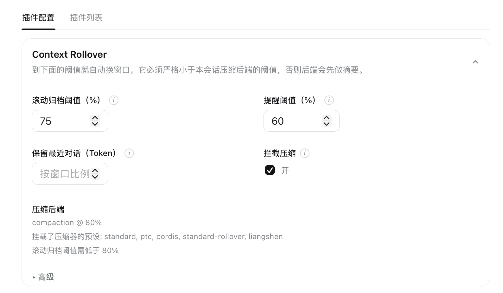

# dsh-context-rollover

[English](README.md) | [中文](README.zh.md)

A [DeepSeek Harness](https://github.com/deepseek-ai/deepseek-harness) bundle for
**model-driven context self-management**: the model ends a context window on purpose and
continues in a fresh one, with **no summarization**. Its own notes and the last few
messages carry over; everything else stays in the session log, searchable on demand.
Inspired by the context-management model in `openai/codex`.

This repository is a rewrite and continuation of the original
[dsh-context-rollover](https://github.com/athif23/dsh-context-rollover), started by
athif23.

## What you get

Stock compaction waits for the window to fill up, then has an LLM summarize what it is
about to drop. This plugin replaces that with notes the working model wrote itself:

| | Summarization (`dsh-compaction-basic`) | Rollover (this plugin) |
|---|---|---|
| What survives | an LLM's summary of the dropped conversation | the model's notes, its handoff, and the last messages verbatim |
| When it happens | when the counter trips — possibly mid-task | at a phase boundary the model picks |
| The dropped conversation | summarized away | kept, and searchable with the `history` tool |
| Cost | one extra LLM call per compaction | zero; the same notes always give the same checkpoint |

In one line: **the model that did the work writes the handover, instead of a stranger
guessing what mattered.**

It installs into any profile and works in every session, next to the compaction backend
that is already there — it preempts that backend, it does not replace it. No credentials,
no network calls, no telemetry; the only thing it writes are markdown notes under
`<dsh home>/notes/<session id>/`.

## Screenshots

**The switch sits where you already look.** The icon in the session stats row *is* the
state — a recycle mark means this session rolls over, a split square means it keeps its own
compaction backend — and the tooltip spells out what the current mode does and what a click
switches to.


**The knobs, with the arithmetic done for you.** The settings card edits the rollover and
reminder thresholds and the retained tail, and reports the backend this session compacts
through (`compaction @ 80%` here), so the rollover threshold can stay below it.



*Screenshots show the Chinese UI; human-facing text follows the app's language.*

## Install

Latest release — the plugin tarball is attached to it:

**https://github.com/mumchristmas/dsh-context-rollover/releases/latest**

You already run DSH, so hand it to the agent in a session:

```text
Download the latest dsh-context-rollover release asset into this working directory and install
it into my "<profile>" profile — from the release asset, not npm — then restart that profile:

  curl -LO https://github.com/mumchristmas/dsh-context-rollover/releases/latest/download/dsh-context-rollover-0.3.2.tgz
  dsh plugin --profile <profile> add ./dsh-context-rollover-0.3.2.tgz
```

By hand it is the same two commands. The profile restarts once because its plugin
composition changed; after that, the card under **Settings → Plugin configuration** and the
mode button under the composer show you it is live.

### Supported DSH host lines

The peer ranges accept every line this repository is built and tested against:

| Line | Versions |
|---|---|
| Public compat line (npm) | `0.0.1-rc.1` … `0.0.1-rc.5` |
| Source line in the sibling checkout | `0.1.0-rc.x`, `0.1.5-rc.x` |

Each range is written as an explicit union — `>=0.0.1-rc.1 || >=0.1.0-rc.1 || >=0.1.5-rc.0` —
because semver only lets a prerelease satisfy a comparator whose `[major, minor, patch]`
tuple also carries a prerelease. **A new host prerelease line has to be added to that union
by hand**; no static range can accept an arbitrary later tuple, and
`tests/metadata.spec.ts` pins both the accepted lines and that limit. The ranges carry no
upper bound, so a future major version installs without complaint: compatibility with a
line is established by building and testing against it, not by the installer.

## Use

- **It works on its own.** At 75% of the window it rolls over using the notes and the
  last messages; from 60% it reminds the model once per window to save notes and cross at
  a clean point. A provider-confirmed context overflow forces the same rollover and
  retries the request.
- **The model can steer it.** `new_context` asks for a boundary at the next safe point,
  `notes` is its own working memory, `history` searches what left the window, and
  `get_context_remaining` reports the numbers.
- **You can steer it.** `/rollover on | off | status | now`, or the icon button in the
  session stats row (recycle mark = rollover, split square = standard compaction). The
  choice is per session and survives reload, fork, and resume.
- **You can read what survives.** Notes are plain markdown in
  `<dsh home>/notes/<session id>/`. Read them, correct them, keep them.

The notes directory is treated as a boundary, not just a folder: note paths are validated
lexically *and* physically, so a symlink placed inside it cannot make a legitimate
`path=linked.md` read or overwrite a file outside it. Links that genuinely point inside stay
usable. Writes replace a file atomically, and a note that cannot be read is never mistaken
for an empty one — it is reported instead of being overwritten. Two limits are worth stating
plainly: Node has no `openat`, so a race between resolution and open cannot be eliminated
outright, and this is a per-session directory on one machine, not a sandbox.

The rollover and reminder thresholds and the retained tail live in the **Plugin
configuration → Context rollover** settings card (`thresholdRatio: 0.75`,
`reminderThresholdRatio: 0.6` by default; the tail is edited in tokens, and empty means the
deployment's share of the window, `retainRatio: 0.1`). Every knob also has a row in the
plugin's `cordis.yml`.

## Read the source, then file issues

This bundle changes how your conversation is managed — do not take this README's word for
it. **Point your best agent at the source and audit it with you:**

```text
Read github.com/mumchristmas/dsh-context-rollover (start with src/index.ts and src/rollover.ts)
and explain in plain language what it does to my session: what it writes, what it calls,
when it fires, and anything that looks risky. Quote the code.
```

It is a small TypeScript package: `src/index.ts` (the interceptor, its listeners, the
commands), `src/rollover.ts` (the surface replacement inside DSH's compaction
transaction), `src/checkpoint.ts` (what the fresh window receives), `src/notes.ts` and
`src/history.ts` (the two stores), `src/tools.ts` (what the model can call),
`src/guidance.ts` (the one prompt section it adds), `src/settings.ts` / `src/mode.ts`
(the knobs and the per-session switch), `src/i18n.ts` (human-facing text, English and
Chinese), `src/client/index.cjs` (the browser button). `src/compat.ts` bridges two host
version lines.

Found a bug, a security concern, or a design you disagree with? **Open an issue** —
https://github.com/mumchristmas/dsh-context-rollover/issues

## Credits

Thanks to athif23, who started the original
[dsh-context-rollover](https://github.com/athif23/dsh-context-rollover). Its design, the
experiments, and the groundwork are his; this repository rewrites and continues that work.

## License

MIT
